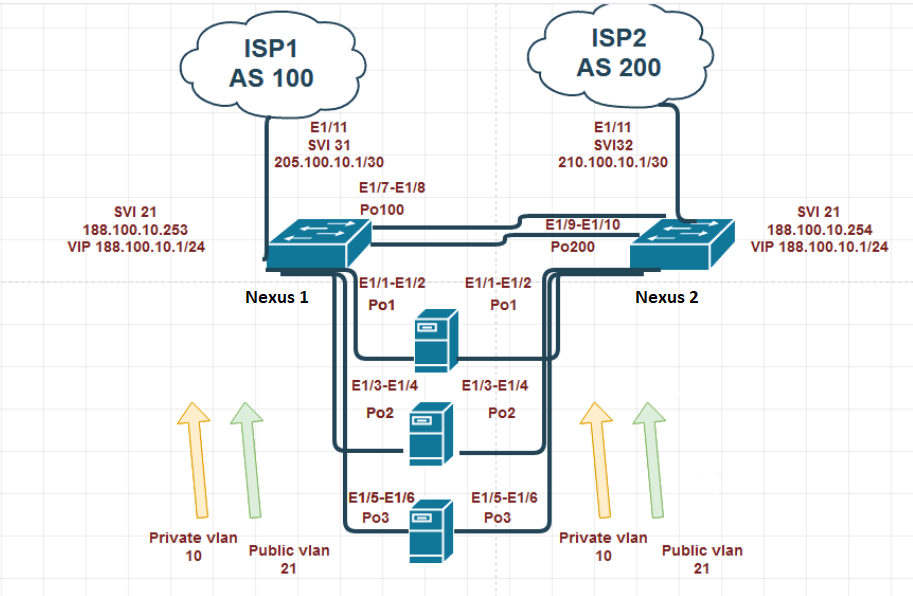

#
#### [English](#English) / [Russian](#Russian)

# Nornir hands-on lab

 

## Introduction
There is an example of using Nornir/Jinja2 plugins
Task: run application to configure Nexus1 and Nexus2 switches accordingly network topology.

## Getting started

1. Clone repositary, activate env (if you want) and install requirements:

~~~~~~~~~~~~~~~~~~~~~~~~~~~~~~~~~~~~~~~~~~~~~~~~~~~~~~~~~~~~~~~~~~~~~~~~~~~~~~~~
git clone https://github.com/bbossankimster/nornir-hands-on-lab.git
cd apartments-search-bot.git
python -m venv env
source ./env/bin/activate
# env\Scripts\activate.ps1
pip install -r requirements.txt
~~~~~~~~~~~~~~~~~~~~~~~~~~~~~~~~~~~~~~~~~~~~~~~~~~~~~~~~~~~~~~~~~~~~~~~~~~~~~~~~
 
2. You can change inventory YAML files in 'inventory' folder

~~~~~~~~~~~~~~~~~~~~~~~~~~~~~~~~~~~~~~~~~~~~~~~~~~~~~~~~~~~~~~~~~~~~~~~~~~~~~~~~
device_configuration\inventory\defaults.yaml describes Nexus's login/password
device_configuration\inventory\hosts.yaml describes Nexus's configuration options (IP addresses, interfaces and so on)
device_configuration\templates\nexus_config_template.j2 describes Jinja2 command template which is applied to Nexus switches
~~~~~~~~~~~~~~~~~~~~~~~~~~~~~~~~~~~~~~~~~~~~~~~~~~~~~~~~~~~~~~~~~~~~~~~~~~~~~~~~

## Basic usage

Run Python application and wait final info:

~~~~~~~~~~~~~~~~~~~~~~~~~~~~~~~~~~~~~~~~~~~~~~~~~~~~~~~~~~~~~~~~~~~~~~~~~~~~~~~~
cd device_configuration
python devices_config.py
~~~~~~~~~~~~~~~~~~~~~~~~~~~~~~~~~~~~~~~~~~~~~~~~~~~~~~~~~~~~~~~~~~~~~~~~~~~~~~~~

 

# Практическая работа с Nornir

## Описание

Приложение подключается по ssh к Nexus1 и Nexus2.
Применяет шаблон конфигурации nexus_config_template.j2 с заданными настройками hosts.yaml.
Конфигурация задана в соответствии с топологией сети

## Начальная установка и настройка

1. Склонируйте репозитарий, активируйте virtual env (если нелбходимо), установите зависимости и модули

~~~~~~~~~~~~~~~~~~~~~~~~~~~~~~~~~~~~~~~~~~~~~~~~~~~~~~~~~~~~~~~~~~~~~~~~~~~~~~~~
git clone https://github.com/bbossankimster/nornir-hands-on-lab.git
cd apartments-search-bot.git
python -m venv env
source ./env/bin/activate
# env\Scripts\activate.ps1
pip install -r requirements.txt
~~~~~~~~~~~~~~~~~~~~~~~~~~~~~~~~~~~~~~~~~~~~~~~~~~~~~~~~~~~~~~~~~~~~~~~~~~~~~~~~

2. Проверьте пароль для подключения к Nexus и настройки конфигурации в YAML файлах
Проверьте шаблон команд Jinja2.
Внесите изменения, если нужно.

~~~~~~~~~~~~~~~~~~~~~~~~~~~~~~~~~~~~~~~~~~~~~~~~~~~~~~~~~~~~~~~~~~~~~~~~~~~~~~~~
device_configuration\inventory\defaults.yaml - логин/пароль для подключения к Nexus
device_configuration\inventory\hosts.yaml describes - настройки конфигурации Nexus (IP addresses, interfaces and so on)
device_configuration\templates\nexus_config_template.j2 - шаблон (Jinja2) команд для применения на Nexus
~~~~~~~~~~~~~~~~~~~~~~~~~~~~~~~~~~~~~~~~~~~~~~~~~~~~~~~~~~~~~~~~~~~~~~~~~~~~~~~~

## Запуск приложения

После запуска ожидайте вывода в консоли об успешном примении команд на Nexus1 и Nexus2
~~~~~~~~~~~~~~~~~~~~~~~~~~~~~~~~~~~~~~~~~~~~~~~~~~~~~~~~~~~~~~~~~~~~~~~~~~~~~~~~
cd device_configuration
python devices_config.py
~~~~~~~~~~~~~~~~~~~~~~~~~~~~~~~~~~~~~~~~~~~~~~~~~~~~~~~~~~~~~~~~~~~~~~~~~~~~~~~~
